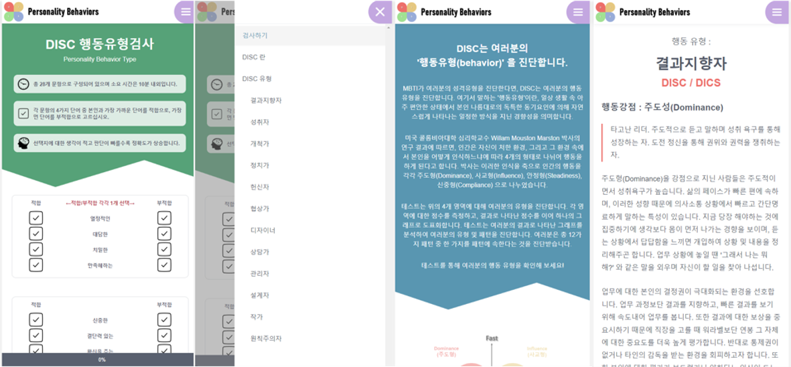

# DISC 행동유형검사 | 12Profiles
 

<b>인간의 행동 패턴에 대한 유형을 진단하는 테스트 <a href="https://15profiles.com">[링크]</a></b>

    2022.08.02 개발 시작 
    2022.08.15 v1.0.0 릴리즈

 

# 구현체
<ul>
    <li>SPA 방식 적응을 위해 State로 페이지 분기.</li>
    <li>Ref를 활용한 답변 미완료 질문 스크롤 기능 구현.</li>
    <li>State로 정의한 Boolean 값을 통해 메뉴 Modal 구현.</li>
    <li>12^28 가지 경우의 수를 12가지 유형으로 구분하는 알고리즘 구현.</li>
    <li>사용자 편의성 및 주사용기기를 고려한 모바일 특화 디자인 UI 구현.</li>
</ul>
 

# 기술 스택
<ul>
    <li>React</li>
    <li>HTML5</li>
    <li>CSS3</li>
    <li>Draw.io</li>
</ul>

